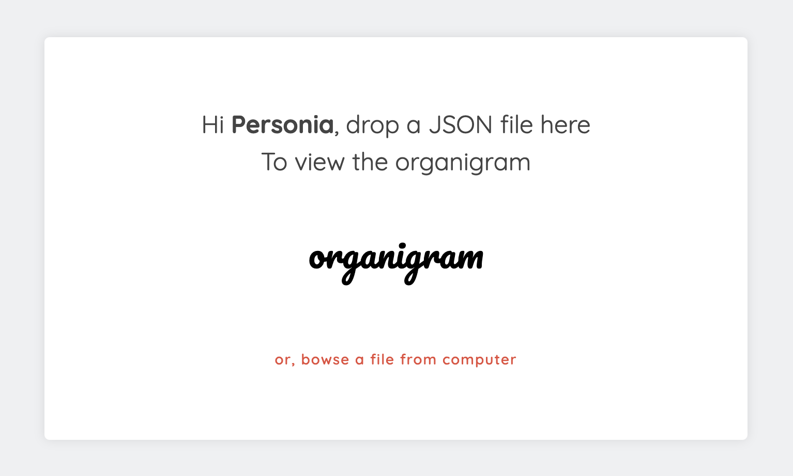
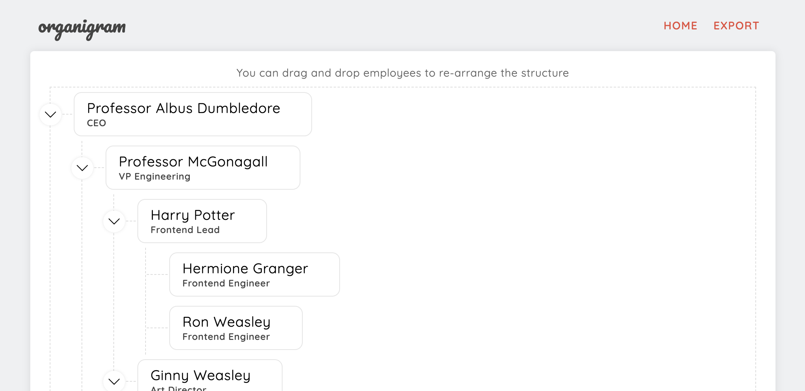

# Organigram
A JSON based tree structure with drag and drop functionally to re-arrange the tree. Show-cases some useful tree operations for deeply nested JSON data and webpack configuration for reducing bundle sizes. It was an interview question from a company in Munich. Fortunately, I didn't got the job. 😎




Help Personia to enjoy her work! 🎉

## Live
You can try the app at [http://organigram.surge.sh](http://organigram.surge.sh). A sample JSON data for testing the functionality can be found [here](./src/sample_json.json).

## Technology Stack
* [react](https://reactjs.org/)
* [react-router](https://github.com/ReactTraining/react-router)
* [react-dnd](https://github.com/react-dnd/react-dnd)
* [redux](https://redux.js.org/)
* [jest](https://jestjs.io/)
* [webpack](https://webpack.js.org/)
* [babel](https://babeljs.io/)
* [eslint](https://eslint.org/)

## Running on local machine
There are couple of ways to run the project. One is to run the production code server, and another one is to run the webpack-dev-server for developing. Either way, we need to install the libraries first. 🤓

### Building the project
To install the libraries, please run the following command:
```
npm install
```

Now, we need to build our project using the following command:
```
npm run build
```

There will be some useful information from `webpack` library like bundle and vendor sizes.

### Running local server
To run the project with distribution code, we need to perform the following command:
```
npm run serve
```
This command will run the server on localhost with a random port number using the library `http-server`. The host and port number can be found in the generated output of this command.

### Running development server
To run the development server with live-reload support, we need perform the following command:
```
npm run serve:dev
```

### Running the tests
There is a set of unit test provided with the application. To run the tests, please perform the following command:
```
npm run test
```

That's it! You're now running Organigram! 🍻 👍 👏🏿 🤞🏾 🤙🏼 🎉

## Code Strategies
There are some useful techniques used in the application to increase the performance and fast loading for user.

### Code splitting
The `react-router` configuration utilizes code splitting mechanism for only loading necessery JavaScript code for certain views.
```js
{
  path: 'organigram_view',
  getComponent(location, cb) {
    // async call for loading the view
    System.import('./Views/Organigram').then(
      module => cb(null, module.default)
    )
  }
},
```
As you might notice the `System.import` call for the required component, which notifies webpack to split the code for this view and make an async call when this view loads in the browser. Webpack genrates different files for related code and only loads required JavaScript file when the view/route is displayed.

### Data Normalization
As the JSON tree is structured with deeply nested employee objects, its costly to perform any move/drag-drop operations in a tree. It generally requires O(n) or O(n-square) complexity. I have performed a normalization operation when the JSON is uploaded and then saved it to redux-store. As an example, let's consider the following JSON structure:
```json
{
  "Professor Albus Dumbledore": {
    "position": "CEO",
    "employees": [
      {
        "Professor McGonagall": {
          "position": "VP Engineering",
          "employees": [
            {
              "Harry Potter": {
                "position": "Frontend Engineer",
                "employees": []
              }
            },
            {
              "Ginny Weasley": {
                "position": "Backend Engineer",
                "employees": []
              }
            }
          ]
        }
      }
    ]
  }
}
```
The normalization operation will convert the structure into the following structure:
```json
{
  "Professor Albus Dumbledore": {
    "name": "Professor Albus Dumbledore",
    "position": "CEO",
    "employees": {
      "Professor McGonagall": true
    }
  },
  "Professor McGonagall": {
    "name": "Professor McGonagall",
    "position": "VP Engineering",
    "employees": {
      "Harry Potter": true,
      "Ginny Weasley": true,
    }
  },
  "Harry Potter": {
    "name": "Harry Potter",
    "position": "Frontend Engineer",
    "employees": {}
  },
  "Ginny Weasley": {
    "name": "Ginny Weasley",
    "position": "Backend Engineer",
    "employees": {}
  }
}
```

This makes move/drag-drop operations more performant with O(1) complexity.
```javascript
// remove the employee from its current supervisor
delete newEmployeeList[sourceSupervisorId].employees[sourceId]

// add the employee to its new supervisor
newEmployeeList[destinationId].employees[sourceId] = true
```

If user wants to export the JSON structure for futher usage or we need to perform an API call at some point, I've also added the logic for de-normalizing the structure.

## LICENSE
MIT. Anything you would like to do.

## Conclusion
The requirements for the solution to the problem I was given, matched my solution and I'm not sure what I missed. But that doesn't matter as I really enjoyed building this project and learned a lot. Would love to know opion from you guys.